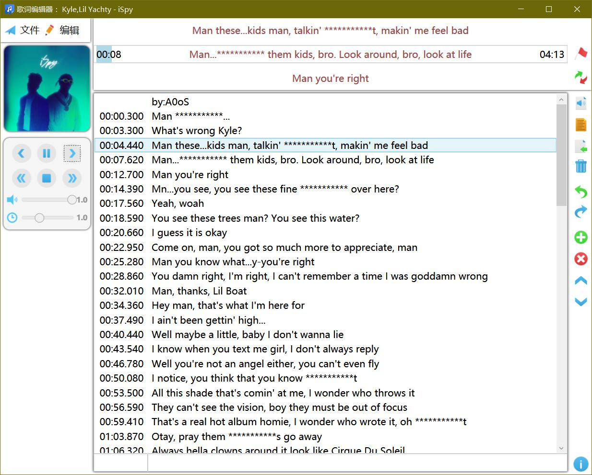

# LyricEditor

A much modified lyric editor with fancy (maybe) UI. Written in `C# 7.0`, `WPF`, `.NET Framework 4.6.2`. Downward compatible to `Windows 7` with `.NET Framework 4` or newer version installed. 

If you want to compile the source code, please use at least Visual Studio 2017 because I was using new features in `C# 7.0` such as:

```C#
int.TryParse(string input, out int output)
```
The current UI is shown below. Only Chinese version is provided.


If you still find the UI unsatisfying, let me introduce my earlier lyric editor to you someday. 

# 歌词制作器

一个优化了界面的歌词制作器，使用 `C# 7.0`，`WPF`，`.NET Framework 4.6.2` 制作。向下兼容至 `Windows 7`（安装了 `.NET Framework 4.0` 及以上）。

如果你想要编译源代码，请使用不低于 `Visual Studio 2017` 的版本，因为代码中个别地方使用了 `C# 7.0` 的新特性。

如果你觉得还是不够好看的话，一定是因为你没见过以前的版本。

知乎链接：[歌词制作器 LyricEditor 第二版发布及使用说明](https://zhuanlan.zhihu.com/p/32588196)

1. 改进，读取mp3自动先读取同目录lrc后读取tag，同时能够识别歌词里的[offset:xxx]标签并将所有歌词进行偏移
1. 播放能够查看之前，当前，之后三句歌词，如果当前歌词宽度超过文本框，则自动滚动
1. tooltips添加快捷键提示，同时添加快进快退，停止，上一行下一行，切换模式等快捷键
1. 当导入歌词检查出错时，不清空文本而是转换到文本编辑模式
1. 更多细节修改
